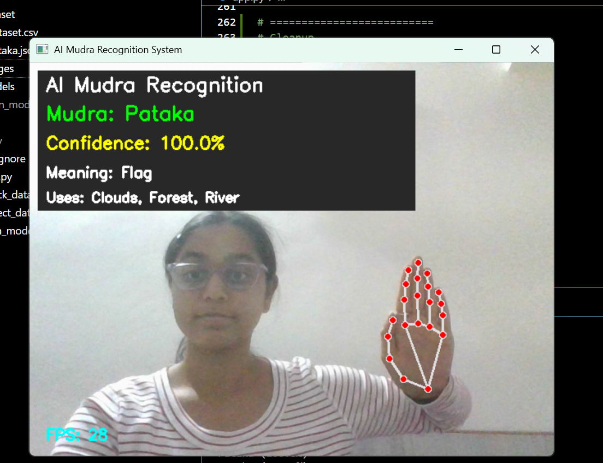
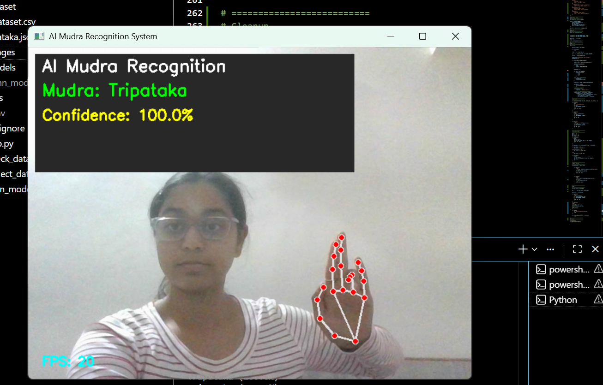
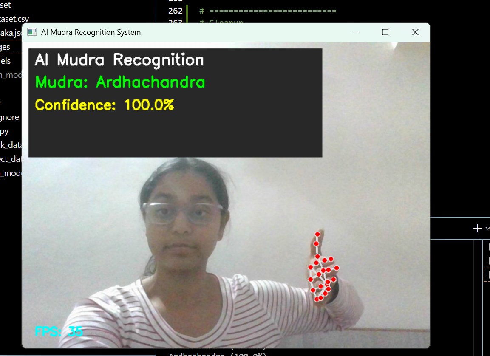
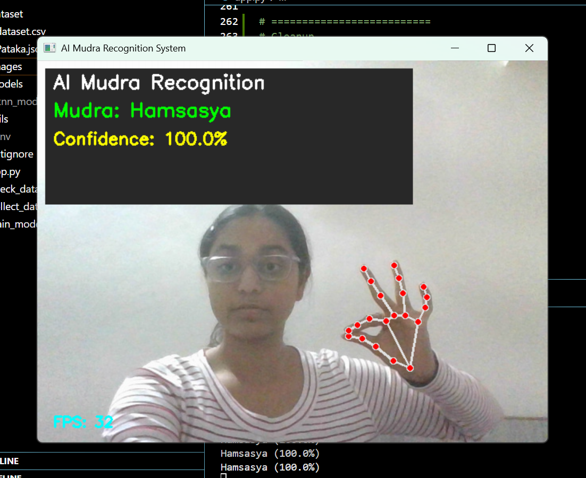

# AI Mudra Recognition System

A real-time AI-based Bharatanatyam Mudra Recognition System that detects hand gestures using a webcam. The project uses **MediaPipe** for hand landmark detection and a **K-Nearest Neighbors (KNN)** machine learning model to classify mudras.

---

## Project Overview

This project recognizes Bharatanatyam **Asamyuktha Hastas (single-hand mudras)** in real time.

The webcam captures the user's hand, MediaPipe extracts 21 hand landmarks, and a trained KNN classifier predicts the corresponding mudra. The application also displays the confidence score, FPS, and information about the detected mudra.

---

## Features

- Real-time hand tracking using MediaPipe
- Detects 5 Bharatanatyam mudras
- Live confidence score
- Confidence progress bar
- Displays mudra meaning
- Displays traditional uses of each mudra
- FPS (Frames Per Second) counter
- Clean and interactive user interface

---

## Supported Mudras

| Mudra | Meaning | Common Uses |
|-------|---------|-------------|
| Pataka | Flag | Clouds, Forest, River |
| Tripataka | Three-part Flag | Crown, Tree, Arrow |
| Ardhachandra | Half Moon | Moon, Blessing, Plate |
| Mushti | Fist | Strength, Anger |
| Hamsasya | Swan's Beak | Delicate objects, Beauty |

---

## Tech Stack

- Python
- OpenCV
- MediaPipe
- Scikit-learn
- Pandas
- NumPy
- Joblib

---

## Machine Learning Workflow

1. Collect hand landmark data using MediaPipe.
2. Save landmark coordinates to `dataset.csv`.
3. Train a KNN classifier.
4. Save the trained model.
5. Perform real-time prediction using the webcam.

---

## Project Structure

```text
MudraRecognition-system/
│
├── dataset/
│   └── dataset.csv
│
├── models/
│   └── knn_model.pkl
│
├── app.py
├── collect_data.py
├── train_model.py
├── check_dataset.py
├── requirements.txt
├── README.md
└── .gitignore
```

---

## Installation

### Clone the repository

```bash
git clone https://github.com/amruthagdsc01-max/MudraRecognition-system.git
```

### Move into the project folder

```bash
cd MudraRecognition-system
```

### Install dependencies

```bash
pip install -r requirements.txt
```

### Run the application

```bash
python app.py
```

---

## Model Performance

- Algorithm: K-Nearest Neighbors (KNN)
- Number of classes: 5
- Test Accuracy: **~85%**

---

## Future Improvements

- Support all 28 Asamyuktha Hastas
- Replace KNN with a Deep Learning model
- Add two-hand mudra recognition
- Voice feedback for detected mudras
- Mobile application support

---

## Screenshots

### Pataka



### Tripataka



### Ardhachandra



### Mushti


### Hamsasya



---

## Demo

A demo video of the project will be added soon.

---

## Author

**Amrutha R N**

Computer Science & Engineering (Data Science)

GitHub: https://github.com/amruthagdsc01-max

---

## License

This project is intended for educational and learning purposes.
